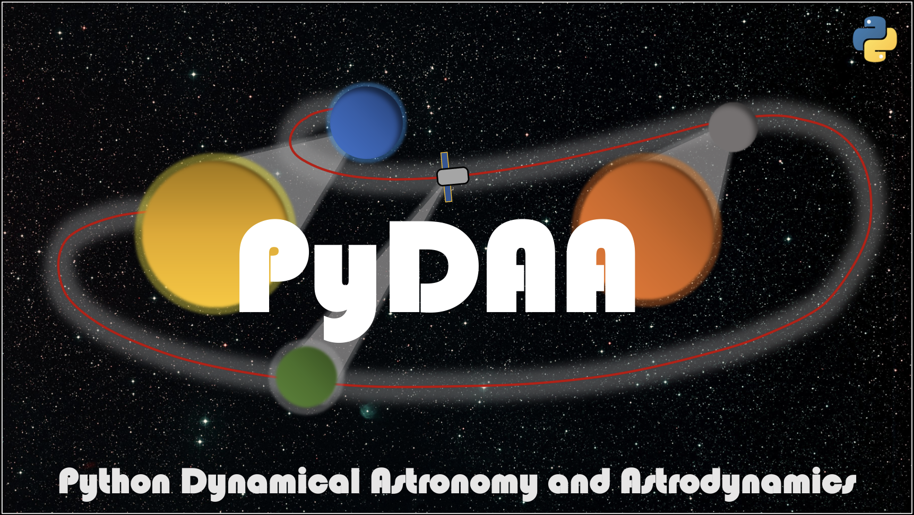

# pyraa
# # Python Restricted Astronomy and Astrodynamics

Package for dynamical systems analysis of restricted three-body models used in dynamical astronomy and astrodynamics

* Does not support N-body integration
* Does not support 2-body orbital dynamics

Author: Drew Langford
Email: langfora@purdue.edu

